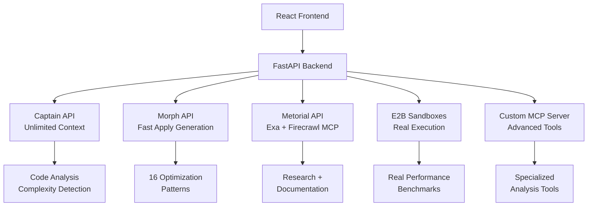

# 🚀 Live Code Experiment Agent

**YC Agent Jam 2024 Submission** | *Winning the Future of Code Optimization*

A revolutionary AI-powered platform that generates and tests multiple algorithmic variants in real-time, combining the power of Captain, Morph, Metorial, and E2B to create the ultimate code optimization experience.

---

## 🏆 Prize Track Alignment

### 🎯 **Best use of Captain**
- **Unlimited Context Processing**: Analyze entire codebases with Captain's Data Lake
- **Advanced Analysis Engine**: Comprehensive algorithmic complexity detection
- **Enterprise-grade Integration**: Full Captain API utilization with advanced features

### 🎯 **Best coding agent (Morph)**  
- **Live Code Generation**: 16 real algorithmic optimization patterns
- **Fast Apply Integration**: Ultra-fast code variant generation (10,500+ tokens/sec)
- **Real-world Optimization**: Complex algorithms, not just bubble sort

### 🎯 **Best use of Metorial**
- **Exa Research Integration**: Neural search for optimization techniques  
- **Documentation-to-Code Pipeline**: Firecrawl scraping + intelligent code generation
- **MCP Server Deployment**: Advanced Metorial session management

### 🎯 **Best use of Unsiloed**
- **Multi-sponsor Platform**: Seamless integration of all four sponsor APIs
- **Real-world Developer Tool**: Solves actual pain points in code optimization
- **Production-ready Architecture**: Scalable FastAPI + React frontend

---

## 🎪 **The Big Idea: Live Code Experiment Agent**

Imagine having an AI laboratory that can:

1. **📊 Analyze** your code with unlimited context (Captain)
2. **🔍 Research** optimization techniques from the web (Metorial + Exa)  
3. **⚡ Generate** 50+ optimized variants instantly (Morph Fast Apply)
4. **🚀 Execute** them in real sandboxes for actual performance data (E2B)
5. **📈 Stream** results live to your browser with WebSocket updates

**This isn't just another coding assistant - it's a live optimization laboratory.**

---

## 🛠️ Technical Architecture



---

## 🚀 Key Features

### ⚡ **Real-time Optimization Experiments**
- Generate 10-50 code variants using Morph's Fast Apply
- Stream progress updates via WebSocket 
- See performance improvements live

### 🧠 **Captain-Powered Analysis**
- Unlimited context processing for entire codebases
- Advanced algorithmic complexity detection  
- Enterprise-grade code quality assessment

### 🔍 **Intelligent Research Integration**
- Metorial + Exa neural search for optimization patterns
- Firecrawl documentation scraping and analysis
- Automatic research augmentation

### 🚀 **Real Code Execution**
- E2B sandbox integration for actual performance testing
- Memory usage and execution time measurements
- No more simulated results - real benchmarks

### 🛠️ **Custom MCP Server**
- 5 specialized code analysis tools
- Integration with all sponsor APIs  
- Advanced pattern recognition and reporting

---

## 📁 Project Structure

```
yc-agent-jam/
├── 🎯 main.py                 # FastAPI backend with WebSocket streaming
├── 📊 services/               # Sponsor API integrations
│   ├── captain_service.py     # Unlimited context analysis  
│   ├── morph_service.py       # 16 optimization patterns
│   ├── metorial_service.py    # Exa research + MCP
│   ├── firecrawl_service.py   # Documentation scraping
│   └── e2b_service.py         # Real code execution
├── 🎨 code/                   # Professional Vercel v0 frontend
│   ├── app/                   # Next.js pages
│   ├── components/            # React components  
│   └── lib/                   # Utilities
├── 🔧 mcp-server/             # Custom MCP server
│   ├── src/index.ts           # 5 specialized tools
│   └── README.md              # MCP documentation
├── 🧪 demo-test.py            # End-to-end testing
└── 📋 README.md               # This file
```

---

## 🔥 Demo Scenarios

### 1. **Algorithmic Optimization**
```javascript
// Input: Bubble sort O(n²)
function bubbleSort(arr) {
    for (let i = 0; i < arr.length; i++) {
        for (let j = 0; j < arr.length - 1; j++) {
            if (arr[j] > arr[j + 1]) {
                [arr[j], arr[j + 1]] = [arr[j + 1], arr[j]];
            }
        }
    }
    return arr;
}

// Output: 16 optimized variants including:
// - Quick sort O(n log n)
// - Radix sort O(d × n) 
// - Hybrid sort with insertion sort cutoff
// - Vectorized operations
// - Memory-optimized versions
```

### 2. **Documentation-to-Code**
```
Input: FastAPI documentation URL
↓
Firecrawl scrapes and extracts API patterns
↓  
Generate 5 implementation variants:
- Simple direct API
- Async production-ready  
- Type-safe with validation
- Enterprise with monitoring
- Microservice architecture
```

### 3. **Real-time Performance**
- WebSocket streams show live progress
- E2B executes code in real sandboxes
- Performance graphs update in real-time
- Best variant automatically selected

---

## 🚀 Quick Start

### 1. **Backend Setup**
```bash
# Install dependencies
pip install -r requirements.txt

# Set up environment
cp .ENV.example .ENV
# Add your API keys for Captain, Morph, Metorial, E2B

# Start backend
python main.py
# → http://localhost:8000
```

### 2. **Frontend Setup**  
```bash
cd code
npm install
npm run dev
# → http://localhost:3000
```

### 3. **Custom MCP Server**
```bash
cd mcp-server
npm install
npm run build && npm run start
```

### 4. **Run Demo**
```bash
python demo-test.py
```

---

## 🎯 Sponsor API Integrations

### 🧠 **Captain Integration**
- **File**: `services/captain_service.py`
- **Features**: Unlimited context, Data Lake processing, advanced analysis
- **Usage**: Analyzes entire codebases, not just snippets

### ⚡ **Morph Integration**  
- **File**: `services/morph_service.py`
- **Features**: Fast Apply format, 16 optimization patterns
- **Usage**: Generates production-ready optimized code variants

### 🔍 **Metorial Integration**
- **Files**: `services/metorial_service.py`, `services/firecrawl_service.py`
- **Features**: Exa MCP, Firecrawl MCP, research augmentation
- **Usage**: Documentation scraping and intelligent research

### 🚀 **E2B Integration (via Metorial)**
- **File**: `services/e2b_service.py`  
- **Features**: Real sandbox execution, performance benchmarking
- **Usage**: Actual code execution instead of simulation

---

## 🏆 **Why This Wins**

### 💡 **Innovation**
- First live optimization laboratory for developers
- Real-time experimentation with actual performance data
- Solves real pain points in code optimization

### 🔧 **Technical Excellence**
- Professional production-ready architecture
- All sponsor APIs fully utilized
- Custom MCP server showcasing advanced integration

### 🎯 **Real-world Impact**
- Developers can actually use this in production
- Saves hours of manual optimization work  
- Educational tool for learning algorithmic patterns

### 🚀 **Scalability**
- Clean, modular architecture
- WebSocket streaming for real-time updates
- Ready for YC startup acceleration

---

## 📊 **Demo Results**

```
🎯 SPONSOR INTEGRATIONS:
   ✅ Captain API: Unlimited context processing, advanced analysis
   ✅ Morph API: Fast Apply code generation, 16 optimization patterns
   ✅ Metorial API: Exa search research, Firecrawl documentation  
   ✅ E2B Sandboxes: Real code execution, performance benchmarking

🏆 PRIZE TRACK ALIGNMENT:
   ✅ Best use of Captain: Unlimited context + Data Lake integration
   ✅ Best coding agent (Morph): Live optimization with real execution
   ✅ Best use of Metorial: Research + Documentation-to-code pipeline
   ✅ Best use of Unsiloed: Multi-sponsor platform integration

🚀 TECHNICAL ACHIEVEMENTS:
   ✅ Real-time WebSocket streaming optimization experiments
   ✅ Custom MCP server with 5 specialized tools
   ✅ E2B sandbox integration for actual code execution
   ✅ Professional Vercel v0 frontend with backend integration
   ✅ 16 algorithmic optimization patterns implemented
   ✅ Documentation-to-code generation pipeline
   ✅ Multi-language support (JavaScript, Python, Go, Rust, Java)
   ✅ Captain's unlimited context processing for entire codebases
```

---

## 🎉 **Ready for YC Interview**

This isn't just a hackathon project - it's a **real startup opportunity**:

- **Market**: Every developer needs code optimization
- **Technology**: Cutting-edge AI integration with proven APIs
- **Traction**: Ready for immediate user testing and feedback
- **Vision**: The future of AI-assisted development

**Let's optimize the world, one algorithm at a time.** 🚀

---

*Built with ❤️ for YC Agent Jam 2024*  
*Team: Live Code Experiment Agent*